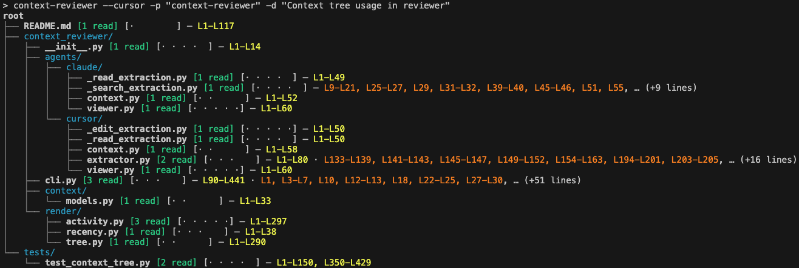

# context-reviewer

CLI tool to review **context used by AI coding agents** — files and line ranges gathered through Read, search, and edit tool calls during an agent session.

Supports **Cursor IDE** (`--cursor`) and **Claude Code** (`--claude`).



## Install

```bash
pip install -e .
```

## Quick start

### Cursor

List projects and dialogs:

```bash
context-reviewer --cursor --list-projects
context-reviewer --cursor --list-dialogs myproject
context-reviewer --cursor --list-all
```

Show the **context tree** for a dialog:

```bash
context-reviewer --cursor -p myproject -d "my chat"
```

### Claude Code

List projects and sessions:

```bash
context-reviewer --claude --list-projects
context-reviewer --claude --list-dialogs myproject
```

Show the **context tree** for a session (matches title, slug, or session UUID):

```bash
context-reviewer --claude -p myproject -d "my chat"
```

Claude sessions are read from:

```
~/.claude/projects/<encoded-project-path>/<session-uuid>.jsonl
~/.claude/projects/<encoded-project-path>/<session-uuid>/subagents/agent-*.jsonl
```

Subagent transcripts are included in the context tree.

## Context tree modifiers

| Flag | Description |
|------|-------------|
| `--files-only` | List file names only (no line ranges) |
| `--edits` | Show edits view instead of reads |
| `--context-tree-depth N` | Limit directory depth below root |
| `--last-turn` | Only files touched after the last user message |
| `--color` / `--no-color` | Force or disable ANSI colors |

Examples:

```bash
context-reviewer --claude -p myproject -d "my chat" --files-only
context-reviewer --claude -p myproject -d "my chat" --edits
context-reviewer --claude -p myproject -d "my chat" --last-turn --context-tree-depth 2
```

## List filters

When using `--list-all` with `--cursor`:

- `--from` / `--before` — date filters
- `-p` — filter by project name (partial match)
- `--limit`, `--sort`, `--desc`, `--updated`

(`--list-all` for Claude Code is not supported yet.)

## Environment

Override the Cursor user data directory:

```bash
export CONTEXT_REVIEWER_CURSOR_USER_DIR=~/path/to/Cursor/User
```

Override the Claude Code config directory:

```bash
export CONTEXT_REVIEWER_CLAUDE_CONFIG_DIR=~/path/to/.claude
```

The upstream `CLAUDE_CONFIG_DIR` variable is also accepted.

The legacy variable `CURSOR_CHRONICLE_CURSOR_USER_DIR` is also accepted for Cursor.

## Development

```bash
pip install -e ".[dev]"
pytest
```

## Attribution

This project is a **combined work** under AGPL-3.0:

- **From [cursor-chronicle](https://github.com/cursor-chronicle/cursor-chronicle) (main):** Cursor DB access in `context_reviewer/agents/cursor/` (messages, utils, viewer) — see [NOTICE](NOTICE).
- **Original to context-reviewer:** domain models in `context/`, terminal rendering in `render/`, Cursor context extraction in `agents/cursor/` (tool_results, extractor, context), Claude Code integration in `agents/claude/`, and CLI in `cli.py`.

## License

GNU Affero General Public License v3 — see [LICENSE](LICENSE).
